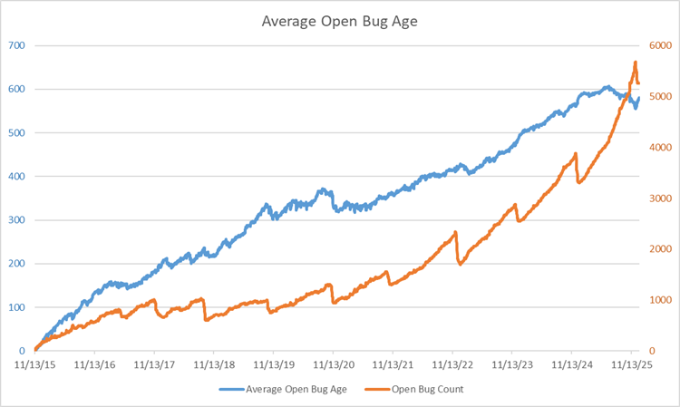

What do Historical ABA Charts look like and what can we learn from them?

Here are some examples.

# Microsoft VS Code

Back to [ABA Index](./index.html).
Back to [MiddleRaster's pages](https://middleraster.github.io/).
