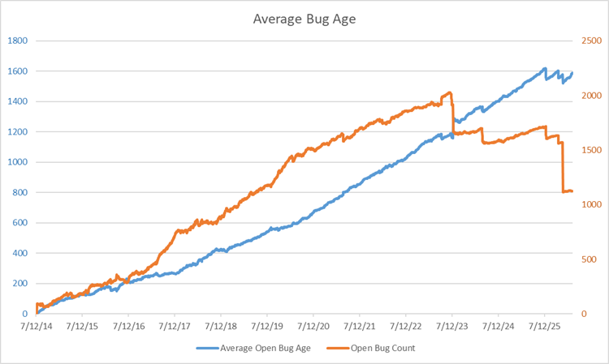
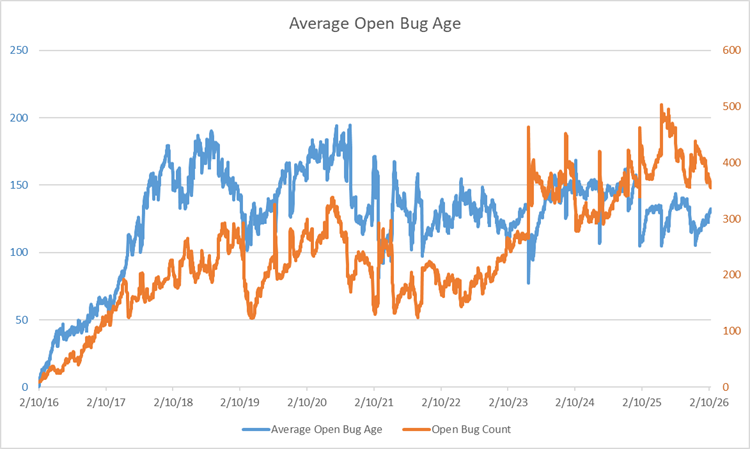
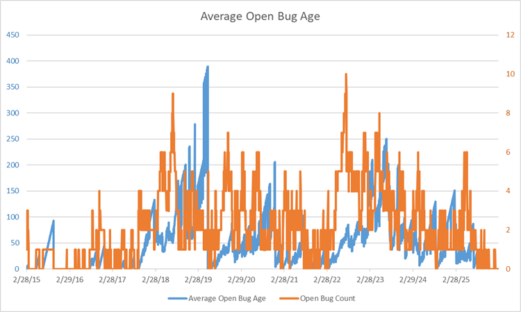

What do Historical ABA Charts look like and what can we learn from them?  

I mined GitHub's issues databases for several well-known projects.  Here are some examples.

In each image, the blue line and axis is the **average age** of open bugs (ABA).  
The orange line and axis is the **number** of open bugs.  
The horizontal axis is, of course, the date.

# Microsoft VS Code

An interesting chart: it looks like this team had a yearly effort to reduce the number of open bugs, but they're not particularly successful.
Over the course of 10 years, they've accumulated over 5000 open bugs, most of which are probably useless.

I applaud their effort to reduce their bug count, but even the ones they did close didn't change the ABA very much. 
Conclusion:  they're fixing or closing recent bugs only.

And that means that their backlog of bugs is just swamped with ancient issues that will probably never get fixed; these should just be closed, as they're only noise.

Two more things:
1.  For the first four years, they kind of kept a handle on things (a little), as they kept their open bug count around a thousand (way too high, in my opinion), but then they completely fell off the wagon. Their bug count started going up and it's going up steeper and steeper - a classic sign that they've accumulated more technical debt than they can handle.
2.  They clearly have never heard of the ABA metric, as right from the get-go their ABA started climbing and is showing no sign of slowing down. The average bug is still open after ~600 days, and that can't be making their customers happy.

# Microsoft TypeScript

A similar, but significantly worse chart from a team that's only 1 year older than the VS Code team.

I see no yearly effort to reduce bugs and their ABA just rises steadily.  
However, two years ago and again just recently, there was a big push to close some bugs, which I applaud, but look at the first effort:  it actually made the ABA go up. 
That means that they were closing only recent bugs, a common refrain at Microsoft, evidently.  

And look at the second push:  even though their bug count dropped by almost half, their ABA held steady at 1600 days (that's over 4 years)!  
They'll never fix those bugs and are just dragging them along for the ride.

And that noise hides the signal about the amount of technical debt they have, other than to say, "Lots." 
Because, if it were quick and easy to fix bugs, they would have fixed them all already.

# Zephyr RTOS

I like this one considerably better:  their bug counts and ABA are an order of magnitude lower than the two Microsoft teams' above.
But more importantly, their ABA isn't running away from them; rather, it's staying relatively steady at a value of about 125 days.

Now, I think 125 days is way too long to wait for the average bug to be fixed, but at least they're fixing them all, eventually.
For a large team (Zephyr is a linux-variant real-time OS), that's not too shabby; that is, the fixing them all part.

# cURL

Here's a team that's really on the ball and has been for the last 11 years.
Their bug count is never over 10 or so, and their ABA for the most part is close to 0, with a couple of exceptions: their biggest spike in ABA was when they only had 1 bug open.

The nice thing about GitHub's issues database is that you can drill into an issue and see what happened to it.
In the case of the bug with the oldest age, it was opened by someone in a corporate environment and who had to get permission to try curl on some public FTP server. 
As you might expect, it took a while to get those permissions.

After about a year or so without hearing back from the user, the bug was closed, with a note that they would re-open it if it still repro'd.
Most of the rest of the bugs had relatively low-ish ages, which is great.

One instructive thing to note:  look at the first blue little spike/triangle shape that went up to 85.
That slope is exactly what you get when a single bug is not addressed. 
Each day, the average bug age goes up by 1, so when scaled appropriately, the slope is exactly 1.0.

# How did you do that?

First, I wrote a little code that downloads issues from GitHub issue databases (see my [GitHub ABA Crawler](https://github.com/MiddleRaster/GithubABACrawler)).  
Then, when I run the crawler, it outputs a .csv file, which I import into Excel.
A little spreadsheet-fu and voila, an ABA chart (I'll upload the spreadsheet when I get around to it).

If you'd like me to interpret your very own ABA chart for you, upload it to one of your GitHub repos and let me know where it is in the comments.

Back to [ABA Index](/ABA/index.html).  
Back to [MiddleRaster's pages](https://middleraster.github.io/).
