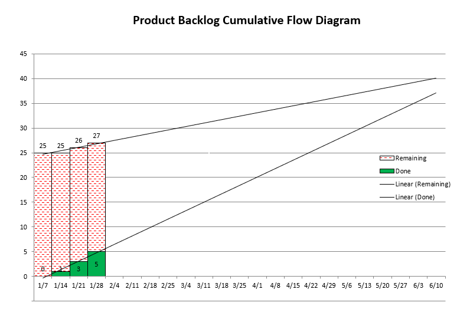
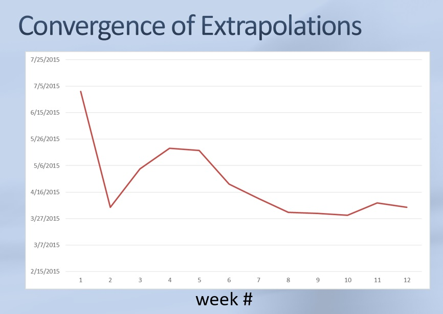

There have been many articles published that purport to explain why our software estimating skills are so poor, but I think they miss the point.  Here's what I think, in 5 parts.

## 1. The Five Orders of Ignorance

In the [October, 2000 issue](https://www.la-acm.org/Archives/laacm0512-Article%2002%20The%205%20Orders%20of%20Ignorance%20OCT%202000.pdf) of the "Communications of the ACM," Philip G. Armour explains what's really going on in software estimation.
Here we go:

- **0th Order Ignorance - "Lack of Ignorance":**  this is when you know everything and life is pretty good when you know everything. In software, we rarely write the same code over and over again, so we're not often in this position. However you could be, if you were doing a port to an operating system that you've ported to before and therefore know everything.

- **1st Order Ignorance - "Lack of Knowledge":**  this one isn't so bad; it's when you realize that you don't know something. Your course of action is clear:  ask someone, do research, experiment, etc., until you do know the answer. If you are asked to give an estimate when you're in this state, you will naturally include time to do that research - don't skimp!

- **2nd Order Ignorance - "Lack of Awareness":**  this is when we start getting into trouble. We don't even realize that we don't know something. These are the "unknown unknowns" that Donald Rumsfeld so famously stated on February 12, 2002. We can't estimate them. We don't even know they exist. If your project management skills are limited to adding up all the estimates (for those items that you do know exist) and using the total to predict when you'll be done, you're going to be in dire straights, because you just gave all those "unknown unknowns" an estimate of 0. And that will not go well, because you gave yourself no time to do all those items. This guarantees schedule slippage as those "unknown unknowns" almost always end up being really important.

-  **3rd Order Ignorance - "Lack of Process":**  in 2nd Order Ignorance, when you start building the software you start discovering all those things you didn't even know existed, but in 3rd Order Ignorance, that process fails. Typically you'll build software that no customer wants. But then they'll tell you, so you do find out eventually, assuming you're still in business.

-  **4th Order Ignorance - "Meta-Ignorance":**  How much worse can it get?  You have 4th Order Ignorance when you don't know about the Five Orders of Ignorance. Now you do. I used to think this was a joke on Armour's part, but it's not: you have been presented with an opportunity. The question now is, how can you make use of this opportunity?

The rest of this post will be about what to do about 2nd Order Ignorance. In the future, I'll have another post on how to fix 3rd Order Ignorance.

## 2. How to Measure 2nd Order Ignorance

Now, you can't measure how many "unknown unknowns" there are (because they're invisible to us), but what you *can* do is measure the **_rate_** at which these new items are being discovered. 
I do it with a simple spreadsheet that generates a stacked bar chart, also known as a Cumulative Flow Diagram (CFD), something like this:

There's a stacked bar for each week. The green bars' height represents work that has been fully completed, while the height of the red bars represents how much work is yet to be done.
Any newly discovered work raises the height of the red bar. A regression line through the tops of the red bars is the **_rate of discovery_** of the "unknown unknowns," while a line through the tops of the green bars is your team's **_velocity_**.
A couple of things should be immediately obvious:
- If these two lines are parallel or, worse, diverge, then you'll never be done. You probably can't do much about the rate of discovery, but you can increase the team's velocity. **_Don't_** just hire more people: that'll slow you down even more. What to do is yet another future post.

- If you don't track like this, it's like saying that the rate of discovery line is absolutely flat. Look at where the horizontal line from top of the left-most red bar intersects with the team velocity line (at about 4/22), and compare that to the intersection point of the velocity and rate of discovery lines (slightly past 6/17), which is our best prediction:  the former is way off. **_The completion date is heavily dependent on the slope of the rate of discovery line_**. In fact, in my experience, the slope of the discovery line completely swamps how bad your estimates are, but more on this below.

## 3. How to Create the Burn-up Chart

I'll link a couple of spreadsheets at the very end of this note, but for now, take a look at this sample table/spreadsheet:

|||                 week ending    | 1/21 | 1/28 | 2/4 | 2/11 | 2/18 | 2/25  | 3/3  | 3/10  | 3/17 |
|-|-|-------------------------------:|:----:|:----:|:---:|:----:|:----:|:-----:|:----:|:-----:|:----:|
|||               done(cumulative)​​​​​ | 0    | 3    | 8   | 12   | 23     | 26      | 28      |       |
|||         work remaining         | 116  | 113  | 114 | 110  | 100    | 102     | 104     |       |
|||         done this Sprint       |      | 3    | 5   | 4    | 11     | 3       | 2       |        |
|||         new work               |      | 0    | 6   | 0    | 1      | 5       | 4       |        |
|||         total work             |      | 116  | 122 | 123  | 124    | 128     | 132     |        |
|||         ship date              |      | #DIV/0! | 12/4/16 | 2/14/17 | 10/14/16 | 10/14/16 | 10/30/16  |
||| **Title**                      | 
||| story description              | 1 | 0 | 0 | 0 | 0 | 0 | 0 | | 
||| another story                  | 1 | 1 | 0 | 0 | 0 | 0 | 0 | | 
||| yet another story              | 1 | 1 | 1 | 0 | 0 | 0 | 0 | | 
||| (lots of data not shown)       |   |   |   |   |   |   |   | | 
||| whole new story                | 1 | 1 | 1 | 1 | 1 | 0 | 0 | | 
||| user story here                |   | 1 | 1 | 1 | 1 | 1 | 0 | | 
||| user story there               |   |   |   | 1 | 1 | 1 | 1 | | 

The date, done and total work rows are what will be used to create the stacked bar chart. 

The first two columns are optional, but useful if you keep your data in TFS/VSTS/AzureDevOps/Jira/etc., and only use the spreadsheet to predict a ship date. If you only use a spreadsheet, you probably won't need ID or Rank.

The important bit is exactly 1 bit:  0 == item is completely done; 1 == item is not done. You can think of it as "work remaining."
You'll note that there are no estimates anywhere, just 0s and 1s. I'll talk about that more in section [5. #NoEstimates](PredictingDespitePoorEstimates.md#5-noestimates).

The work remaining at the end of the current week is easy:  the formula is `=SUM(F9:F99)` (or wherever your last row is). It just sums up everything, 0s and 1s. We really only want the 1s, but the 0s don't hurt anything.

The formula for newly discovered work/requirements is trickier:  `=SUMIF(E9:E99,"=",F9:F99)` which means, "add the cell in column F only if the cell in column E is **empty**."

Given those two things, it's easy to calculate the rest of what's needed for the chart.

Finally, though the chart itself has two regression lines, I also calculate an estimated ship date another way:  using *average* velocities.  A little algebra for the intersection of two lines gives `=(($D$3*(COLUMN()-COLUMN($D$3))/($D$3-F3))*7+$D$1)`.
You'll note that the first entry is `#DIV/0!` because at that point the two lines are parallel.

## 4. How to Use the Burn-up Chart

To use the spreadsheet, we need to distinguish two different scenarios. Pick the one appropriate for you:

  
#### A. Your project data is held somewhere else
 - initial setup
   
   If your project is held in TFS/VSTS/AzureDevOps/Jira/etc. or similar, use your database's export facility to export a .xls/.csv file containing:  ID, stack rank, title, and whether the item is done or not (open/closed).
   
   The ID is immutable, so we can sort all the data by ID, if necessary.
   I typically temporarily import all that data to a different sheet so that I can massage it until it looks just right (e.g., I search-n-replace all the "opens" with a "1" and "closed" with a "0"; whatever's appropriate for your database).
   Once it's all in the just right form, move it to the bar chart spreadsheet.

 - ongoing
   
   I'm going to assume that your team updates that other database. Each week (even if your iterations are longer than that), export the same data as above and pull it into a separate sheet and massage it as necessary.
   
   Then in the spreadsheet, sort all the data by ID (ascending). Any new work will have higher IDs than the last one on the list. Look on the other sheet to see if there are any. If so, copy the rows containing their IDs, stack rank and titles to the final spreadsheet.
   
   Next, copy just the formulas from last week into a **new** column for this week, just to the right of last week.  Then copy the 1s and 0s from the temporary sheet and paste them in the new column.
   Since both sheets are sorted by ID, everything will line up perfectly.

#### B. Your project data is held only in the spreadsheet
 - initial setup
   
   When you (either the product owner, scrum master, project lead, team lead, whatever) create your product backlog list, for each story, add the story/synopsis/user-story/title and a "1".
   
 - ongoing
   
   Each week (even if your iterations are longer than that), copy the entire column of last week's data, including formulas and 1s and 0s to a new column, just to the right of last week's column.
   
   Then, for each story that is complete, change the 1 to a 0.
   Next, for new stories, add a row in the appropriate place so that all the rows are sorted by importance (the newly discovered stories are often the next most important things to do).

At each week's end, you'll have an updated estimate of when all the stories will be done, based on the team's current velocity and the current rate of discovery of new work. 

- There are two more things to discuss:
  
   1. How to tell when story X will be done
      
      So far, we know how to use the bar chart to predict when the last story will be done. But sometimes we want to know when a particular story will be done, for example for cross-team dependencies.
      
      First, ensure that the data is sorted by stack rank, if it isn't already. Then **temporarily** delete all the rows below story X (that is, those stories of lower priority than story X).
      
      The formula and regression lines' intersection will now show you when story X will be done. Once you have your answer, undo.
      
   2. How to stay on track when the ship date *cannot* move
      
      There are times when the ship date absolutely, positively, definitely cannot move; e.g., marketing has promised a date, you have a booth at a conference whose date cannot move, etc. What to do when the ship date is coming in too late?

      The Agile way is to delete the lowest priority items. In the past, I was never entirely sure if we had removed enough or not. Now, with the spreadsheet, I can tell exactly how much we need to remove.

      To remove a story, I cut the entire row (ID, stack rank, title, and 1s) and paste it in some other spreadsheet or below the "cut" line, which is where the formulas stop, but it's for items I don't want to forget.

      Once the row is removed, the bars shorten a bit, which pulls in the ship date. It's as though that story never existed. Repeat until the ship date is where you need it to be.

      Note that once the date is where it needs to be, that doesn't mean you won't discover so much more new (and more important) work that it may push out the ship date too far again, especially if the rate of discovery increases somewhat. In such a case, repeat the removal process.
      And the spreadsheet tells you exactly how much.

## 5. #NoEstimates

I started using this kind of stacked bar chart back in 2006, when I was a lead at *StupendousCorp*, having gotten the idea from one of [Mike Cohn's books](https://www.amazon.com/Agile-Estimating-Planning-Mike-Cohn/dp/0131479415/).
At the time he didn't have things quite right (e.g., his removal method was wrong), but he does now:  see [here](https://www.mountaingoatsoftware.com/agile/scrum/scrum-tools/release-burndown/alternative).

After being a lead for a few years, I joined at team at *StupendousCorp* that did classes/training for other teams; I was their Agile guy and taught a class on estimations, which included this stacked bar chart for tracking. Back then, #NoEstimates didn't exist yet, so I was estimating with 1, 2 and 3.
One day someone in my class asked why I was using 1, 2 and 3; what was so magical about those numbers?
My standard answer was a little weak, that these were the first few Fibonacci numbers, which have the nice feature that the gaps get larger as the numbers increase. 

So I decided to try changing all my estimates from 1:2:3 to 1:3:5. 
Clearly, just doubling everything would have no effect on the intersection point, but slightly different ratios would or so I thought.
In actuality, the intersection point barely moved. Interesting.

A bit later, I was giving the same class (now including these two different sets of ratios) to an entire group, and their architect asked what would happen if I changed everything to a 1.
So I tried that, too, and again, the intersection point barely moved.
I thought about that some and here's what I came up with:  if you took all your estimates and averaged them together, you'd have some number and if you used that number for everything, the intersection point would not move at all.

My conclusion is that the estimates really aren't all that important. They are swamped by the effect of newly discovered work.

Don't believe me? Try it with your own data.
Here is a [sample spreadsheet with estimates](./BarChartCFDWithEstimates.xlsx) that you can populate with your data and estimates.
Then change your estimates' ratios and see how much the predicted ship date shifts. 
In my experience, it's only by a couple percent.

Here's [the spreadsheet I prefer](./BarChartCFD_%23NoEstimates.xlsx) without estimates.

## Final Thoughts

Here are some final thoughts:

 - One of the best things about tracking a project this way is that **it's really hard to argue with**.
   
   I remember the very first time I used it, my manager at *StupendousCorp* was a very smart lady, with a PhD in math, but from a former Eastern Bloc, rather totalitarian country which meant that she'd get a little grumpy if things didn't go her way.

   Anyway, we were in my office, estimating, etc., and when we were done, I printed the CFD bar chart, drew the lines by hand ('cuz I hadn't worked up all the formulas yet), and proudly announced, "We'll be done in 39 weeks."
   She said, "39 weeks?!  You only have 16 weeks!!" and stormed out of my office.

   A little while later, she stormed back in and said, "Ok, let's make some cuts."  Quite so.

   The chart puts an end to a lot of managerial or marketing pushback to "compress the schedule" or other such nonsense. It'll make your life a whole lot easier.

 - In line with the above, I **post the CFD chart prominently**, such as on my door, on a wall (printed on as large a sheet of paper as possible):  an "information radiator."

   Another tip:  tape the next week's chart right on top of the previous week's. This allows you to track how our extrapolated ship date has changed over time.
   In fact, I occasionally plot a chart showing exactly that:
   

 - **How long does it take for the extrolated ship date to converge?** A month or two.
   In the beginning is when you know the least, so the first few weeks' ship dates won't be that great.
   But it settles down relatively quickly. The one pictured above took a bit longer than most.

 - **What should you track?** Not tasks, but rather user stories. Slicing up user stories into small pieces is a skill the team will need to develop if it doesn't have it already. That's another future post.

   What about epics? There are two ways to handle epics.
   
   First, you could break them all down as best you know how at the beginning of the project, and let the software development process discover all the second order ignorance. This is what I usually do, even though it's more work upfront.

   Alternatively, you could ignore the problem. Give it an estimate of 1, just like anything else, but when it gets close, split it into multiple user stories, each with an estimate of 1.
   You'll get a bit of a stair-case effect, but after doing a couple epics, the regression line through the tops of the red bars will take this break-it-down-as-we-get-close process into account and the ship date will settle down.
   
 - **SOX compliance**:

   I've never lived in this world, but I had a long discussion after class with a dev who did.
   
   When I asked what his current process was he said that he spend about 30% of the time doing upfront design, which mmeant that on a year-long project, he didn't write any code for about 4 months.
   His problem was that even after all that big design upfront, his estimate of when he'd be done was poor (that's why he was taking my class).
   
   I told him that what I would do is work the Agile way:  start coding on day 1, and call it prototyping or designing, making a "silver thread" framework/skeleton that I'd gradually flesh out until I have the whole product.
   He seemed satisfied with that, because after 4 months, you'd not only have a good estimate of when you'll be done, but you'd have 30% of the project written already.

